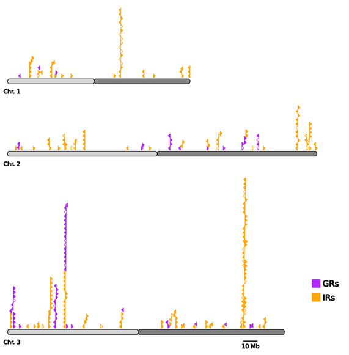

# Gene location across chromosome Chart generator
## Example, created with example.py on unprovided gff file

## Usage
- Download plotter.py and place it in either the directory of the project or in an import path.
- Import `plotter` in your python program
- Create a list of `Triangle` objects to describe each gene you want to plot for each chromosome. E.g. 3 chromosomes = 3 lists
- For each chromosome create a `Graph` object using the corresponding list of triangles
- Create a `Output` object and add each `Graph` to this object using `Output.add_graph` in bottom-up order
- Call `Output.finalize` to add the scale marker and an optional key showing what each color corresponds to
- Call `Output.visualize` to display the plot